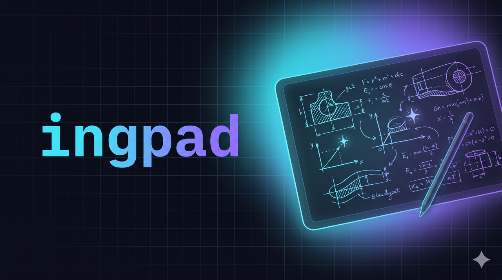
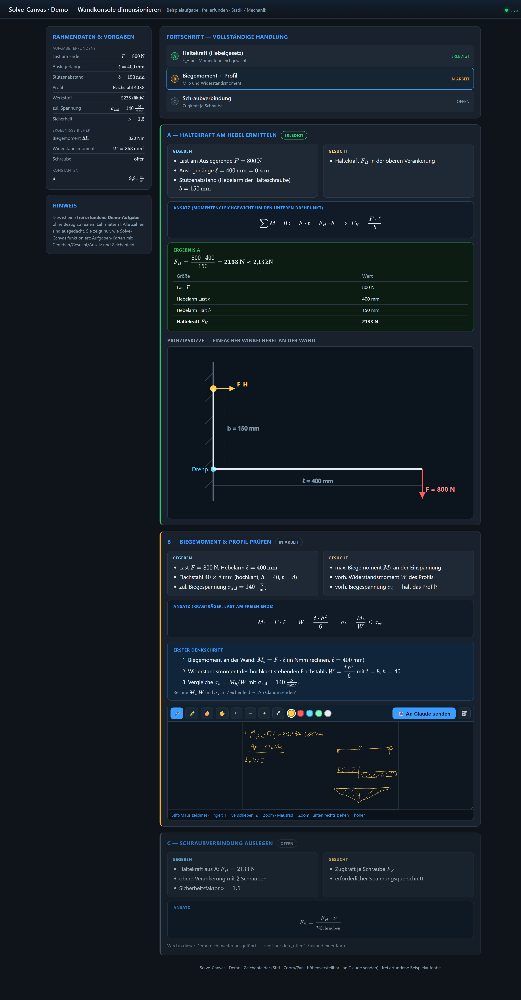
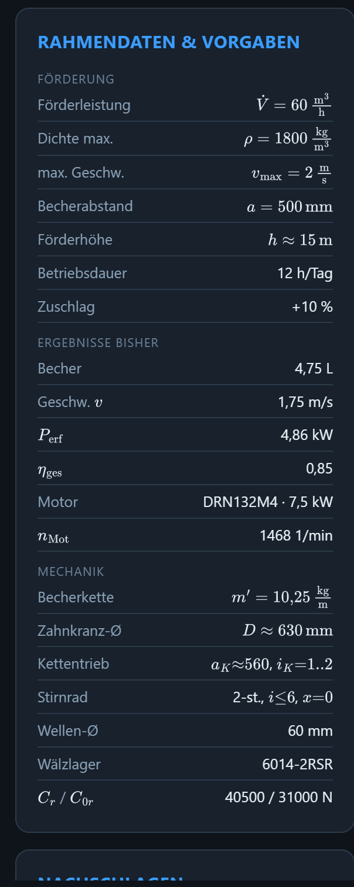
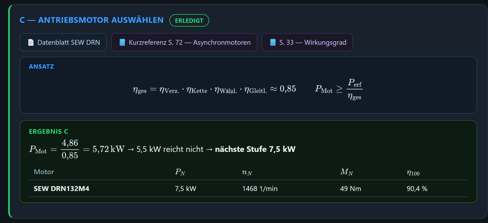
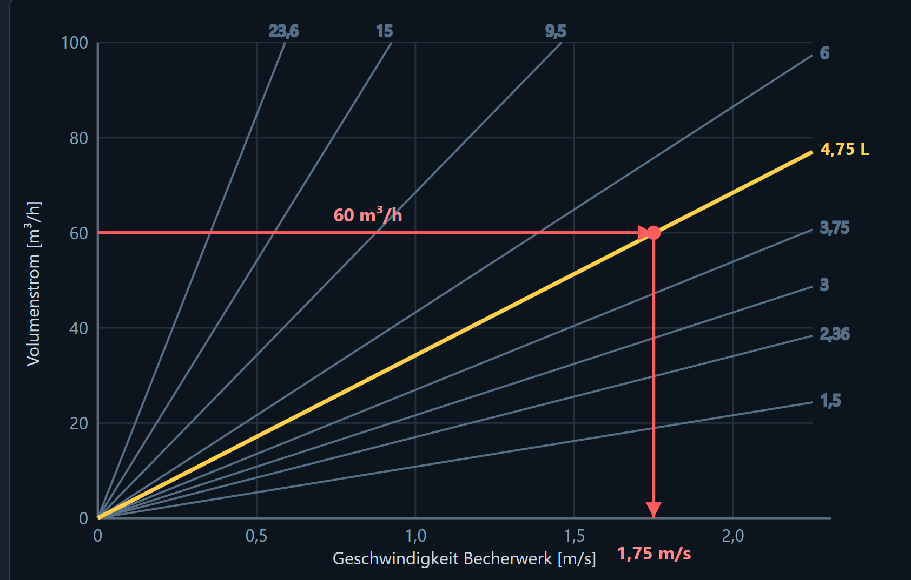
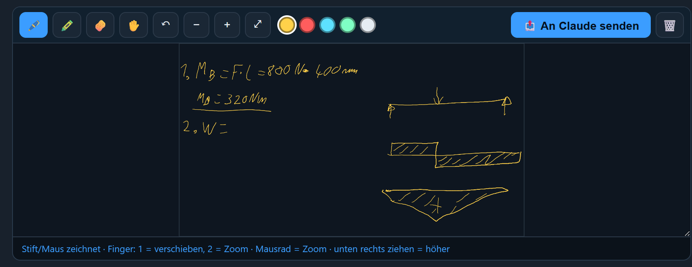
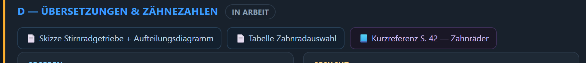

# ingpad



**▶ [Live-Demo ausprobieren](https://moritzv42.github.io/ingpad/)** — läuft direkt im Browser, kein Setup.

> The engineer's scratch pad — solve a technical exercise on one canvas: framework data, step-by-step **Given / Sought / Approach**, stylus sketches and an AI tutor, side by side.



`ingpad` turns a technical exercise (the kind you get in engineering / technician school) into a single interactive canvas. You solve each step by **handwriting** into a drawing field; the AI checks your work, records the result, and opens the next step.

It's deliberately **socratic**: you think, the AI asks and verifies — it doesn't just hand you the answer.

---

## What's on the canvas

### 📌 Framework data, always in view

The left rail pins every given value, limit and component for the whole exercise — and fills in with results as you go. No more scrolling back to the task sheet.



### 🧮 Each step: Given · Sought · Approach

Every step is laid out the way you'd write it on paper — knowns, unknowns, the formula to apply — and gets a green result box once it's solved.



### 📈 Graphical work, rendered crisply

Diagrams are real SVG (not blurry images), so construction lines land exactly. Here: picking a bucket size from the volume-flow chart — horizontal at 60 m³/h to the 4.75 L line, then straight down to 1.75 m/s.



### ✍️ Handwrite each step, send it to the AI

The drawing field is **stylus-first**: the pen draws, one finger pans, two fingers zoom; it's height-adjustable with zoom & pan. Hit **send to AI** and the field ships as an image — the AI reads your handwriting, grades the step, and records the result.



### 🔗 Everything about the task, one click away

Per step, the source documents **and the exact page of your formula sheet** are linked — so everything you need is one click away, including the current quick-reference.



---

## Quick start

```bash
git clone https://github.com/MoritzV42/ingpad
cd ingpad
python server.py            # serves projekte/demo on http://localhost:8042/index.html
```

Open the URL, pick a step, handwrite your calculation, hit **send to AI**, then tell your AI agent it was sent — it reads the image, grades it, fills in the result.

> The screenshots above show the included **demo** (a fictional wall-bracket statics task — copyright-free) and a real worked example (bucket-elevator drivetrain).

## How it works

```
  step (Given / Sought / Approach)
        |
        v   you handwrite the calculation in the drawing field
   [ drawing field ] --send--> server  --> submit_<step>.png
        |                                        |
        |                                        v
        |                          AI reads the image, grades it,
        v                          writes the result back into the canvas
   next step opens                 and opens the next step
```

The AI side currently runs through **Claude Code** (the agent reads `submit_<step>.png`). A model-agnostic, in-app chat (bring your own / local model) and a hosted, multi-user version are on the [roadmap](ROADMAP.md).

## Add your own exercise

```
projekte/
└─ <your-exercise>/
   ├─ index.html         # copy an existing project as a template
   ├─ <your source PDFs> # gitignored — see below
   └─ ...
```

Then `python server.py <your-exercise>`.

> ⚖️ **Exercise PDFs are not included.** School materials (e.g. DAA-Technikum) are copyrighted by their authors. `*.pdf` is gitignored on purpose — bring your own; the app is generic.

## Roadmap

[ROADMAP.md](ROADMAP.md) — from this local tool to a hosted platform: drag&drop PDF input → auto-built canvas, automatic PowerPoint + calc-document export, a model-agnostic in-app AI chat (no terminal needed), per-step file attachments, dark/light mode, and login-gated sharing of solutions mapped to modules & exercises.

## License

[MIT](LICENSE) © Moritz Voigt · part of [Moritz Voigt — Open Source](https://moritzvoigt.infinityspace42.de)
